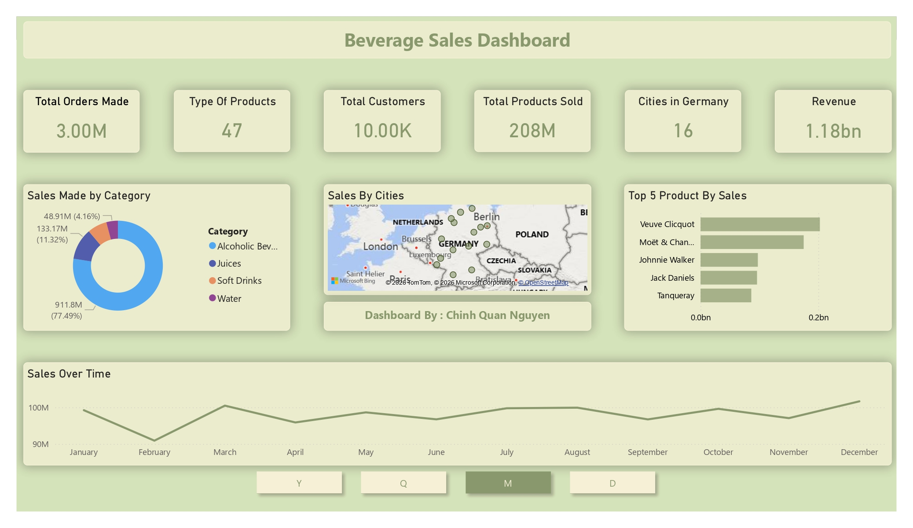

# Beverage Sales Dashboard

## Preview



## Overview

The **Beverage Sales Dashboard** presents an overview of beverage sales performance across **products, categories, regions, and time**.

Built with **Power BI**, the dashboard highlights key business metrics such as total revenue, customer base, order volume, and product distribution, enabling quick insight into sales drivers and trends.

This dashboard answers questions:
- How much revenue has been generated?
- Which beverage categories contribute the most to sales?
- Which products and regions perform best?
- How do sales fluctuate over time?

## Key Metrics

- Total Orders Made: 3.00M
- Total Customers: 10.00K
- Total Products Sold: 208M
- Types of Products: 47
- Regions Sold To: 16
- Total Revenue: 1.18 billion

## Key Insights

Category Performance:
- Alcoholic Beverages dominate sales, generating approximately **911.8M revenue (77.49%)**, making it the primary revenue driver.
- Juices contribute around **133.17M (11.32%)**.
- Soft Drinks account for **82.80M (4.16%)**.
- Water represents a smaller portion of total sales for **48.91M (4.16%)**.

Top 5 Products by Sales:
1. Veuve Clicquot
2. Moët & Chandon
3. Johnnie Walker
4. Jack Daniels
5. Tanqueray

Regional Distribution:
- All sales regions are located **within Germany**, with data covering **16 distinct regions**.
- Sales concentration varies by region, highlighting differences in regional demand across major German cities.

Sales Over Time:
- Monthly sales remain relatively stable throughout the year.
- Noticeable peaks appear in **March, July-August, October and December**, suggesting mild seasonality rather than extreme fluctuations.

## Dataset

The dataset used in this project is sourced from **Kaggle**:  
[Beverage Sales](https://www.kaggle.com/datasets/sebastianwillmann/beverage-sales)

The dataset is a **synthetic beverage sales dataset** designed to simulate real-world sales operations.

Dataset Structure:
- Order_ID
- Customer_ID
- Customer_Type (B2C)
- Category (Alcoholic Beverages, Juices, Soft Drinks, Water)
- Unit_Price
- Quantity
- Discount
- Total_Price
- Region
- Order_Date

The data was cleaned and transformed in **Power BI** before building the dashboard.

## Tools Used

- Power BI Desktop

## Usage

To explore the dashboard:

1. Download and install **Power BI Desktop**.
2. Clone this repository.
3. Open `Beverage_Sales_Dashboard.pbix` using Power BI.
4. Interact with the dashboard to explore more insights.

## Project Structure

```text
.
├─ dataset/
│  └─ synthetic_beverage_sales_data.rar
├─ report/
│  └─ Beverage_Sales_Dashboard.jpg
│  └─ Beverage_Sales_Dashboard.pdf
├─ Beverage_Sales_Dashboard.pbix
└─ README.md
```

## Contact

For inquiries and collaborations, feel free to reach out to chquan.nguyen@gmail.com.
